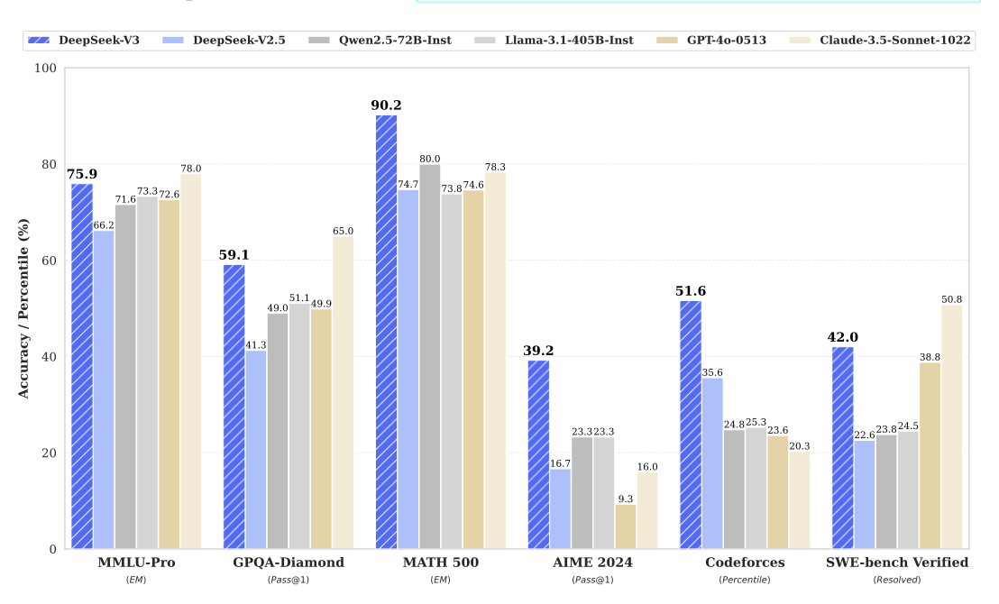

# DeepSeek-V3 Technical Report

**Paper**: DeepSeek-V3 Technical Report

**Authors**: DeepSeek-AI

**Presenter**: Roshan Sivakumar

**Date**: November 4, 2025

---

## Overview

### Context
The foundation for models like DeepSeek-V3 is the Transformer architecture, which is powerful but has two well-known scaling problems:

- **Inference Cost**: Standard attention requires a Key-Value (KV) cache that grows with the sequence length, making long-context inference (like 128K tokens) extremely expensive.

- **Training Cost**: "Dense" models, which use every parameter for every token, are prohibitively expensive to train at the scale of hundreds of billions of parameters.


### Problem Statement
How can we build a state-of-the-art, trillion-parameter-scale model that is cheap to train, fast for long-context inference, and avoids the performance trade-off of traditional MoE models?

### Approach (DeepSeek-V3)

DeepSeek-V3 solves this with a holistic co-design across different areas:

1. **Architecture**: It uses Multi-head Latent Attention (MLA) to compress the KV cache for efficient 128K context and DeepSeekMoE for sparse, cost-effective training.

2. **Training**: It pioneers an auxiliary-loss-free load balancing strategy that eliminates the MoE performance trade-off. It also uses Multi-Token Prediction (MTP) to get a denser training signal and accelerate inference.

### Key Results

- **SOTA Performance**: DeepSeek-V3 is the top-performing open-source model, achieving performance comparable to leading closed-source models like GPT-4o and Claude 3.5 Sonnet.



- **Unmatched Efficiency**: The entire training process was completed in only 2.788M H800 GPU hours, with remarkable stability and no loss spikes.

---

## Architecture Deep-Dive

This is the technical core of the paper. DeepSeek-V3 modifies the standard Transformer block by replacing the two main components: Attention and the Feed-Forward Network (FFN).

### Multi-head Latent Attention (MLA)

- **Problem**: Standard attention has a massive KV cache, which creates an inference bottleneck for long contexts.
- **Solution**: MLA compresses the Key and Value vectors into a tiny shared latent vector ($c_t^{KV}$). This tiny vector is the only thing that gets cached, saving enormous amounts of memory. The full-size Key and Value vectors are then reconstructed on-the-fly from this cache during the attention calculation.

    MLA replaces standard MHA to break the $O(n^2)$ KV cache memory bottleneck. It uses low-rank joint compression to store attention states efficiently.

#### Formal Comparison: MLA vs. Standard Attention

| Mechanism | Standard MHA (Baseline) | DeepSeek-V3 MLA |
| :--- | :--- | :--- |
| **KV Cache Content** | Stores full vectors $\mathbf{K}, \mathbf{V} \in \mathbb{R}^{d \times l}$ | Stores compressed latent $\mathbf{c}^{KV} \in \mathbb{R}^{d_c \times l}$ and decoupled $k^R \in \mathbb{R}^{d_R \times l}$ |
| **Cache Memory** | $O(d_{model} \cdot l)$ (memory bottleneck for large $l$) | $O((d_c + d_R) \cdot l)$, where $d_c \ll d_{model}$ (memory efficient) |
| **Key/Value Derivation** | $\mathbf{K} = W_K \mathbf{Z}$ (Direct linear projection) | $\mathbf{K}^C = W^{UK} \mathbf{c}^{KV}$ (Up-projected from latent $\mathbf{c}^{KV}$) |

#### Algorithm: Multi-Head Latent Attention (MLA)

This algorithm defines the forward pass of MLA, which achieves efficient inference by compressing Keys and Values into a low-rank latent space for caching.

```
Algorithm: MultiHeadLatentAttention(h_t, KV_cache)

Input:
  h_t ∈ R^d                          // Current token hidden state at position t
  KV_cache = {c_j^KV}_{j=1}^{t-1}    // Compressed KV representations for previous positions

Output:
  o_t ∈ R^d                          // Attention output

Hyperparameters:
  d_c                                // Compressed latent dimension (d_c << d)
  d_R                                // Dimension for decoupled RoPE key
  n_h                                // Number of attention heads

Weight Matrices:
  W^DKV ∈ R^{d_c × d}                // Down-projection for joint KV compression
  W^UK, W^UV                         // Per-head up-projection matrices (for reconstruction)
  W_Q, W^KR, W_O                     // Query, RoPE key, and output projection matrices

// Step 1: Compute Queries and Decoupled RoPE Key
q_t ← W_Q · h_t

k_t^R ← W^KR · h_t
k_t^R ← RoPE(k_t^R, t)              // Apply rotary position encoding
// Store k_t^R in cache (for positional information)

// Step 2: Compute Compressed Latent KV and Update Cache
c_t^KV ← W^DKV · h_t                // c_t^KV is the compressed vector
KV_cache ← KV_cache ∪ {c_t^KV}      // ONLY c_t^KV is cached (memory efficient)

// Step 3: Attention Loop Over All Heads
for i ← 1 to n_h do
    // Step 4: Decompress/Reconstruct Keys and Values (On-the-Fly)
    for j ← 1 to t do
        k_j^i ← W_UK^i · c_j^KV     // Content Key Reconstructed
        v_j^i ← W_UV^i · c_j^KV     // Value Reconstructed

    // Step 5: Compute Attention Scores
    for j ← 1 to t do
        score_{t,j}^i ← (q_t^i)^T · (k_j^i + k_j^R) / √d_h

    // Step 6: Apply Softmax and Compute Head Output
    α_{t,j}^i ← Softmax(score_{t,:}^i)
    o_t^i ← Σ(j=1 to t) α_{t,j}^i · v_j^i

// Step 7: Final Output
o_t ← W_O · Concat({o_t^i}_{i=1}^{n_h})

return o_t
```

### DeepSeekMoE (Mixture-of-Experts)

**High-Level**: This is how the model scales to 671B total parameters. For any given token, a "router" selects and activates only 37B of those parameters.

DeepSeekMoE replaces the FFN layer. Its innovation is the **Auxiliary-Loss-Free Balancing** strategy, which decouples load stability from the accuracy objective.

- **Problem**: Standard MoE models require an "auxiliary loss" to keep the experts balanced, which conflicts with the main goal of modeling language and hurts performance.

- **Solution**: DeepSeek-V3 uses an **Auxiliary-Loss-Free Balancing** strategy:
  1. It uses a non-differentiable bias ($b_i$) to select which experts to route to. This forces the load to be balanced.
  2. It uses the original, unbiased scores to calculate the gating weights (the output). This protects the model's performance.

  This **decouples** the balancing from the model's loss, solving the core MoE trade-off.

#### Formal Comparison: Loss-Free MoE vs. Traditional MoE

| Mechanism | Traditional MoE (Baseline) | DeepSeek-V3 Loss-Free MoE |
| :--- | :--- | :--- |
| **Load Balancing** | Uses a differentiable $\mathcal{L}_{Aux}$ term added to the training loss | Uses a **non-differentiable bias ($b_i$)** updated outside the gradient pass |
| **Selection Score** | $s_{i,t}$ (original affinity) | $s_{i,t} + b_i$ (Bias is added **only for Top-K selection**) |
| **Gating Value (Gradient Flow)** | Calculated from biased score $s_{i,t} + b_i$ | Calculated **only from original score $s_{i,t}$** |

#### Algorithm: DeepSeekMoE Forward Pass

This algorithm defines the forward pass of the DeepSeekMoE layer, incorporating the non-differentiable bias ($\mathbf{b}_i$) only for expert selection, maintaining the integrity of the gradient signal.

```
Algorithm: DeepSeekMoE_FFN(h_t, W, b)

Input:
  h_t ∈ R^d            // Token representation at position t
  W                    // All differentiable expert weights and router matrices
  b ∈ R^N_r            // Non-differentiable dynamic bias vector (externally updated)

Output:
  h_t' ∈ R^d           // Updated token representation

Hyperparameters:
  N_s                  // Number of shared experts
  N_r                  // Number of routed experts
  K_r                  // Number of activated routed experts (e.g., K_r = 8)

// Step 1: Compute Shared Experts
h_shared ← Σ(i=1 to N_s) FFN_i^(s)(h_t)

// Step 2: Compute Router Affinities (Original Score)
for i ← 1 to N_r 
    s_i,t ← Sigmoid(h_t^T · e_i)

// Step 3: Select Top-K Experts (Uses the Non-Differentiable Bias)
// Rationale: The bias b_i is used here to ensure load balance
for i ← 1 to N_r 
    s_i,t^biased ← s_i,t + b_i

Indices ← TopK({s_j,t^biased}_{j=1}^{N_r}, K_r)

// Step 4: Compute Gating Values (Uses the ORIGINAL, Unbiased Score)
// Rationale: The original score s_i,t maintains the performance objective
g_i,t' ← Gather(s_i,t, Indices)

for i ∈ Indices 
    g_i,t ← g_i,t' / Σ(j ∈ Indices) g_j,t'

// Step 5: Compute Routed Experts and Final Output
h_routed ← Σ(i ∈ Indices) g_i,t · FFN_i^(r)(h_t)

h_t' ← h_t + h_shared + h_routed

return h_t'
```

### Multi-Token Prediction (MTP)

**The Idea**: Instead of just training the model to predict the next token ($t+1$), MTP adds small, sequential modules that also predict the tokens after that ($t+2$, $t+3$, etc.).

**The Benefits**:
1. **Denser Training Signal**: This provides more gradients per token, which helps the model learn faster and better.
2. **Faster Inference**: The MTP modules are discarded at inference, or they can be used for **speculative decoding**, achieving a 1.8x speedup.

---

## Question 1
For MLA, if the model just compresses the KVs and then immediately decompresses them to calculate attention, why bother compressing them in the first place? Isn't that just wasted work?

<details>
<summary>Click to reveal answer</summary>

It's not about **compute**, it's about the **memory bottleneck**.

A GPU has two main memory zones:
- **HBM (High-Bandwidth Memory)**: This is the main, large (e.g., 80GB) but slower memory.
- **SRAM (On-Chip Cache)**: This is the tiny but blazing fast memory where computations (like matrix multiplies) actually happen.

In a Standard Transformer, the full KV cache is massive (gigabytes for a 128k context) and lives in "slow" HBM. The bottleneck is the time it takes to read this giant cache from HBM into SRAM for every single new token.

With MLA, we only store the tiny compressed vector ($c_t^{KV}$) in "slow" HBM. Reading this is extremely fast. The decompression (an extra matrix multiply to reconstruct K and V) happens in fast SRAM.

So, we trade a slow memory-read bottleneck for a fast compute operation, and the net result is a massive speedup for long-context inference.
</details>

---

## Question 2
DeepSeek-V3's MoE is successful because it avoids the conflict between a model's primary loss (accuracy) and the auxiliary loss (balancing). Based on the architecture, how does the router guarantee a balanced load across experts without using any loss function gradients?

<details>
<summary>Click to reveal answer</summary>

The router achieves this using a decoupled, non-gradient mechanism:

- **Selection (Hard)**: It uses a non-differentiable bias term, $b_i$, which penalizes experts that were recently overloaded. This bias **forces** the selection to be balanced for the next token batch.

- **Bias Update**: The bias $b_i$ is updated manually, **outside the backward pass**, by monitoring the actual expert load for the entire training batch. If Expert $i$ is overloaded, $b_i$ is increased, making it harder for the next batch of tokens to select it.

- **Learning (Soft)**: Critically, the model's gradient and output still rely only on the **original, unbiased affinity score** ($s_{i,t}$). This protects the model's performance while the external mechanism handles the load stability.
</details>

---

## Critical Analysis

### Strengths

**SOTA Performance**: The model decisively outperforms all other open-source models, especially in complex reasoning, math, and code. It's the first open model to be truly comparable to closed-source leaders like GPT-4o and Claude 3.5.


**Incredible Training Efficiency**: The entire model was trained for only 2.788M H800 GPU hours. This is a new blueprint for economical SOTA, proving that holistic co-design can be more effective than just brute-force compute. The training was also remarkably stable, with no irrecoverable loss spikes.

**Holistic Co-Design**: The paper's main strength isn't just one idea. It's the successful integration of architecture (MLA, MoE), training strategies (FP8), and custom systems (DualPipe) to solve multiple bottlenecks at once.

### Limitations and Areas for Improvement

1. **High Deployment Cost**: The model is cheap to train, but it's still a massive 671B parameter MoE model. The paper itself admits the "recommended deployment unit... is relatively large, which might pose a burden for small-sized teams". Its accessibility for real-world use is still limited.


2. **Hardware-Specific Efficiency**: The impressive efficiency gains are not universal. They are highly co-designed for a specific, massive cluster of H800 GPUs with NVLink and InfiniBand. These speedups (like DualPipe) may not be reproducible on smaller, different, or consumer-grade hardware.

3. **Overlooked Qualitative Analysis**: The paper proves that its MoE router is balanced, but not what the 256 experts actually specialize in. For example, does Expert #5 become a "Python expert" and Expert #12 a "JSON expert"? This qualitative analysis of expert specialization is missing.

---

## Impact

This paper's impact is less about a single new idea and more about providing a practical, economical, and stable blueprint for building SOTA models.

### Immediate Contributions

1. **Closes the Open-Source Gap**: This is the first open-source model to be truly competitive with leading closed-source models like GPT-4o and Claude 3.5 Sonnet on their home turf (complex reasoning, math, and code). It proves that open-source can achieve SOTA performance.

2. **Defines the New MoE Playbook**: It solves the biggest problem with MoE models. The "auxiliary-loss-free" router is a major breakthrough that proves you don't have to trade performance for training stability. Future large-scale MoE models will almost certainly copy this design.

3. **Makes 128K Context Economical**: MLA provides a practical path for 100K+ context windows without needing massive, specialized inference hardware. It makes long-context truly deployable.

4. **Proves Efficiency Beats Brute Force**: The model's success comes from a holistic co-design of its architecture (MLA/MoE), training (MTP), and custom systems (FP8/DualPipe). It shows that a smarter, more efficient design can beat a larger, "denser" model (like Llama 3.1 405B) with far less training compute.

---

## Code Demonstration

A conceptual Jupyter Notebook is included in the repository. It demonstrates the two core architectural ideas to meet the rubric's code requirement:

1. **MLA vs. MHA Cache Savings**: A direct calculation showing the massive (50x+) memory savings of MLA's compressed cache ($O(n \cdot d_c)$) compared to a standard KV cache ($O(n \cdot d_{model})$).

2. **Loss-Free Router Simulation**: A conceptual demo of the DeepSeekMoE router, showing how the non-differentiable bias $b_i$ is updated outside the gradient pass to balance expert load.

---

## Resource Links

1. [DeepSeek-V3 Technical Report](https://arxiv.org/abs/2412.19437) - The paper being presented
2. [DeepSeek-V3 GitHub Repository](https://github.com/deepseek-ai/DeepSeek-V3) - The official model checkpoints and code
3. [DeepSeek-V2 Technical Report](https://arxiv.org/abs/2405.04434) - The predecessor paper that introduced MLA and DeepSeekMoE
4. [Formal Algorithms for Transformers](https://arxiv.org/abs/2207.09238) - The baseline paper from our course
5. [LoRA: Low-Rank Adaptation](https://arxiv.org/abs/2106.09685) - A key paper for parameter-efficient finetuning, for comparison

---

## Citation

```bibtex
@article{deepseekv3_2024,
  title={DeepSeek-V3 Technical Report},
  author={DeepSeek-AI},
  journal={arXiv preprint arXiv:2412.19437},
  year={2024},
  eprint={2412.19437},
  archivePrefix={arXiv},
  primaryClass={cs.CL}
}
```
